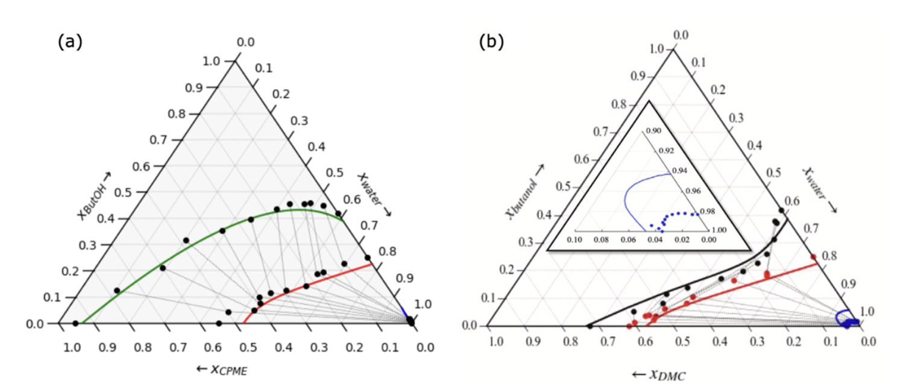

The first stage of this project was to implement a sistematic methodology to predict phase equilibria using molecular simulations and SAFT-based equations of state. Within this objective we planned to tackle a three stage development with case systems with increased modeling complexity:
- A binary LJ mixture
- Non-associative refrigerant mixtures
- Associative fluids

## Binary LJ Mixture, A global interfacial map for LJ mixtures.

We employed Molecular Dynamics simulations with LAMMPS [^1] to explore the relationship between phase equilbria and interfacial behavoir of binary Lennard-Jones (LJ) mixtures of equal size. We selected a reference fluid with $\varepsilon_1$ = 148 K and $\sigma_1$ = $\sigma_2$ = 3.73 Å, and assigned $\varepsilon_2$ and $\varepsilon_{12}$ based on the $\zeta$ and $\Lambda$ coordinates of the global phase diagram, as shown in [^2]:

$\zeta=\frac{\varepsilon_2 - \varepsilon_1}{\varepsilon_2 + \varepsilon_1}$

$\Lambda=\frac{\varepsilon_2 - \varepsilon_12 + \varepsilon_1}{\varepsilon_2 + \varepsilon_1}$

Simulation cell were built as standard coexistence orthorombic cells with two liquid phases and a vapor phase as shown in the following Figure. Each phase was filled with molecules according to their composition and density, as predicted with a preliminary calculation from a SAFT-VR Mie equation of state [^3], imposing an equivalent LJ potential. SAFT calculations were carried out in the SGTpy python module [^4], which is an open-source code distributed through the following Git-hub: 

  
  <figcaption>Figure 1: Simulation box setup used for VLLE calculations. </figcaption>

We have tested the phase and interfacial behavior of several mixtures varying the ($\zeta, \Lambda$) coordinates. For each mixture we sampled 4-5 temperatures along the VLLE line to extract the phase envelope and its respective wetting behavior, which is related to the three available interfacial tensions ($\gamma^{\alpha\beta}, \gamma^{\beta\delta}, \gamma^{\alpha\delta}$). Interfacial tensions were calculated using the Irving and Kirkwood formulation [^5], building and integrating the $P(z)$ profile along the z direction as:

$\gamma^{\alpha\beta}=\int_{a}^{b} P_N-P_T dz  $            

where $a$ and $b$ are the centers of the $\alpha$ and $\beta$ bulks. Different wetting behaviors can be identified as a function of how the three interfacial tensions behave with temperature. When the three tensions are ordered as $\gamma^{\alpha\delta}$ > $\gamma^{\beta\delta}$ and $\gamma^{\alpha\beta}$ we can write the relationship:

**as : :** $\gamma^{\alpha\delta} <= \gamma^{\beta\delta} + \gamma^{\alpha\beta}$

**or as : :**  $S^{\beta,\alpha\delta} = \gamma^{\beta\delta} + \gamma^{\alpha\beta} - \gamma^{\alpha\delta}$

If the inequality holds for every temperature the system exhibits partial wetting. If the equality holds for every temperature the system exhibits complete wetting. And if the inequality switches to an equality at a certain temperature it exhibits a wetting transition temperature ($T_w$), which can be 1st order or 2nd order transitions depending on the curvature (linear or quadratic) of the $S^{\beta,\alpha\delta}$ function when approaching $T_w$

  
  <figcaption>Figure 2: Interfacial tension interplay for systems with (a) partial wetting, (b) perfect wetting, (c) 1st order wetting transition and (d) 2nd order wetting transition. </figcaption>

We applied this methodology to explore the phase diagram and found different wetting behaviors depending on the ($\zeta, \Lambda$) coordinates. Those are shown in Figure 3 where each simulation set of 4-5 temperatures is shown by a single point in the diagram. Regions where the behavior is changing from one type of wetting to another are further populated to get better accuracy of the transition regions. A cleaner final diagram is also shared with the four wetting regions placed 

  
  <figcaption>Figure 3: Construction of the global wetting diagram for binary LJ mixtures of equal size A: partial wetting, B: complete wetting, C: 1st oder transition, D: 2nd order transition. The reduced $T_w*=T_w/\varepsilon_1$ </figcaption>

This tool, in conjunction to the global phase diagram, is a fast and reliable method to predict the relationship between phase and interfacial behavior in model mixtures. Only by defining the interaction potential between both species, one can know (a priori) which equilibria and which wetting will the mixture exhibit.

## NEXT

The vapor-liquid-liquid equilibria (VLLE) for water + butanol + polar entrainer mixtures was evaluated using the group contribution-based molecular SAFT-VR Mie equation of state . To that end, we used the 

We modeled the binary water + butanol / water + entrainer / entrainer + butanol binary mixtures, using as entrainers = cyclopenthyl methyl eter (CpME) and dimethyl carbonate (DMC). We saw good accuracy in reproducing all binary phase equilibria and then proceed to model the three-phase equilibria. Since no experimental data was available for the ternary VLLE line, we carried out three-phase equilibrium experimental determinations with thecommercial Fisher VLE/VLLE 602 equilibrium cell available in the Cohesion Laboratory at the Universidad de Concepción: 

We obtained the following ternary three phase lines for each system, which all behave zeotropically and exhibit no heteroazeotropic point (no temperature minimum within the ternary 3-phase line). However, we observed that the mutual miscibilities amongst water/butanol/entrainer depend strongly on the polarity of the entrainer and specially on their associative capabilities. CpME has a single hydrogen bond (HB) acceptor site in the -O- atom, whereas DMC has three sites (two carbonyl =O and a ether -O- atoms). So the DMC LLE is much "thinner" than in CpME. In fact, DMC shows even a has a convex curvature in its ternary LLE, showing a strong deviation from the (more) common concave pattern shown by CpME.

  
  <figcaption>Figure 2: VLLE for water + butanol + entrainer = (a) CpME or (b) DMC. Blue, black and red correspond to the aqueous liquid, organic liquid and vapor phases, respectively. Dots are experimental determinations performed at the cohesion laboratory and lines are SAFT models </figcaption>

These results denote that associative compatibility is negative for the separation of water + butanol mixtures, because it favors mixing, instead of separation. It is worth noting that some of this compounds are great entrainers for ethanol dehydration, but etanol is naturaly more compatible with water that butanol, so it is more succeptible to be dehydrated by polar entrainers. The lower water compatibility of butanol makes it unsuitable for polar entrainer dehydration.

The complete works with more technical details are compiled in the corresponding publications [^3],[^4]. Please check them out for more information. 
  
Additionally, some codes and tutorials are shared in here to teach how to calculate these particular phase equilibria with SGTpy:
  - **Recommended Start:** VLLE prediction with SGTpy _(insert link to tutorial 1)_
  - **Water+Butanol+CPME:** 
  - **Water+Butanol+DMC:** 
    

[^1]:
[^2]:
[^3]: Lafitte, T., Apostolakou, A., Avendaño, C., Galindo, A., Adjiman, C.S., Müller, E.A., Jackson, G. (2013) Accurate statistical associating fluid theory for chain molecules formed from Mie segments. J. Chem. Phys. 139 (15): 154504.
[^4]: Mejía, A. E.A. Müller, G. Chaparro, (2021) SGTPy: A Python Code for Calculating the Interfacial Properties of Fluids Based on the Square Gradient Theory Using the SAFT-VR Mie Equation of State. J. Chem. Inf. Model. 61: 1244-1250.
[^3]: Alonso, G., Cartes, M., Mejía, A. (2025) Vapor-liquid-liquid equilibria for the water + 1-butanol + CPME mixture. Fluid Phase Equilib. 591: 114297
[^4]: Ulloa, A., Cartes, M., Alonso, G., Mejía, A. (2025) Three phase equilibria and interfacial properties of water + dimethyl carbonate + 1-butanol ternary mixture. J. Mol. Liq. 439: 128785

---------------------------------------------------------------------------

<a href="./Methodology" class="banner-link etapa-1">
  STAGE 1: Methodology & Molecular Simulation
</a>

<a href="./Non-polar-entrainers" class="banner-link etapa-2">
  STAGE 2: Non-polar Entrainers (Hydrocarbons)
</a>

<a href="./Polar-entrainers" class="banner-link etapa-3">
  STAGE 3: Polar Entrainers (Ethers & Mixed)
</a>
