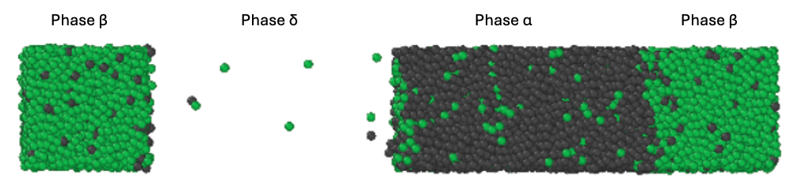
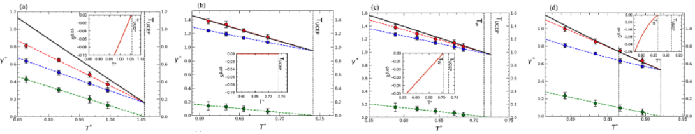
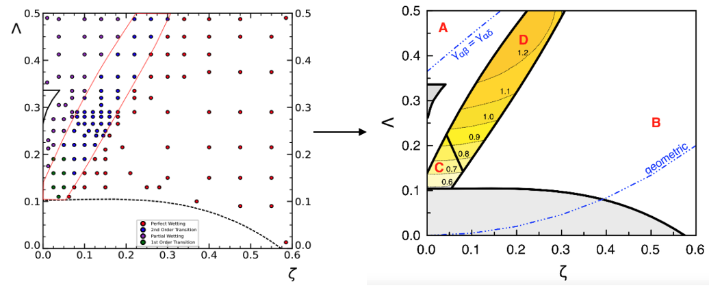
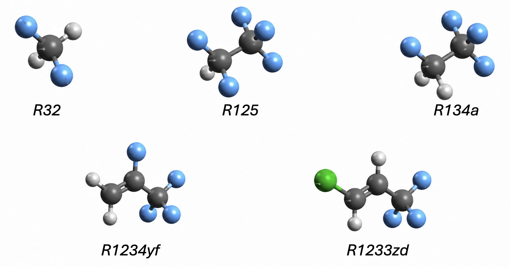
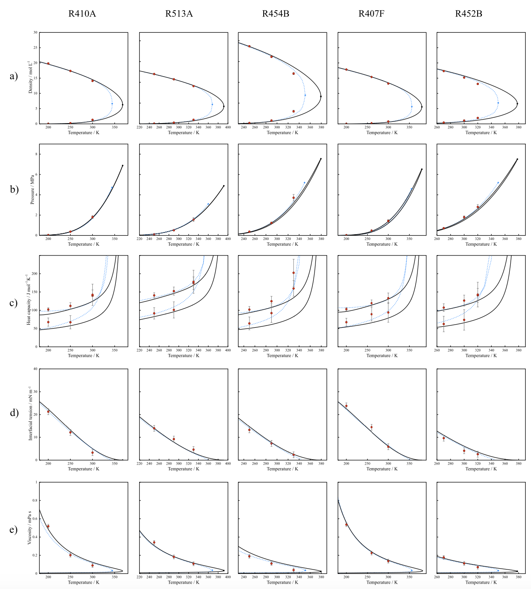
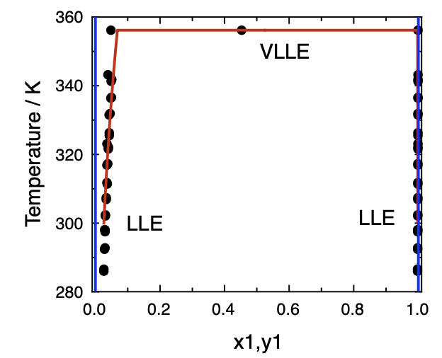

The first stage of this project was to implement a sistematic methodology to predict phase equilibria using molecular simulations and SAFT-based equations of state. Within this objective we planned to tackle a three stage development with case systems with increased modeling complexity:
- A binary LJ mixture
- Non-associative refrigerant mixtures
- Associative fluids

## Binary LJ Mixture, A global interfacial map for LJ mixtures.

We employed Molecular Dynamics (MD) simulations with LAMMPS [^1] to explore the relationship between phase equilbria and interfacial behavoir of binary Lennard-Jones (LJ) mixtures of equal size. The LAMMPS code can be downloaded and installed as shown by their webpage: https://www.lammps.org/#gsc.tab=0

We selected a reference fluid with $\varepsilon_1$ = 148 K and $\sigma_1$ = $\sigma_2$ = 3.73 Å, and assigned $\varepsilon_2$ and $\varepsilon_{12}$ based on the $\zeta$ and $\Lambda$ coordinates of the global phase diagram, as shown in [^2]:

$\zeta=\frac{\varepsilon_2 - \varepsilon_1}{\varepsilon_2 + \varepsilon_1}$

$\Lambda=\frac{\varepsilon_2 - \varepsilon_12 + \varepsilon_1}{\varepsilon_2 + \varepsilon_1}$

Simulation cell were built as standard coexistence orthorombic cells with two liquid phases and a vapor phase as shown in the following Figure. Each phase was filled with molecules according to their composition and density, as predicted with a preliminary calculation from a SAFT-VR Mie equation of state [^3], imposing an equivalent LJ potential. Results were compatible since the interaction potential is equivalent in both representations. SAFT calculations were carried out in the SGTpy python module [^4], which is an open-source code distributed through the following Git-hub: 

  
  <figcaption>Figure 1: Simulation box setup used for VLLE calculations. </figcaption>

We have tested the phase and interfacial behavior of several mixtures varying the ($\zeta, \Lambda$) coordinates. For each mixture we sampled 4-5 temperatures along the VLLE line to extract the phase envelope and its respective wetting behavior, which is related to the three available interfacial tensions ($\gamma^{\alpha\beta}, \gamma^{\beta\delta}, \gamma^{\alpha\delta}$). Interfacial tensions were calculated using the Irving and Kirkwood formulation [^5], building and integrating the $P(z)$ profile along the z direction as:

$\gamma^{\alpha\beta}=\int_{a}^{b} P_N-P_T dz  $            

where $a$ and $b$ are the centers of the $\alpha$ and $\beta$ bulks. Different wetting behaviors can be identified as a function of how the three interfacial tensions behave with temperature. When the three tensions are ordered as $\gamma^{\alpha\delta}$ > $\gamma^{\beta\delta}$ and $\gamma^{\alpha\beta}$ we can write the relationship:

**as : :** $\gamma^{\alpha\delta} \le \gamma^{\beta\delta} + \gamma^{\alpha\beta}$

**or as : :**  $S^{\beta,\alpha\delta} = \gamma^{\beta\delta} + \gamma^{\alpha\beta} - \gamma^{\alpha\delta}$

If the inequality holds for every temperature the system exhibits partial wetting. If the equality holds for every temperature the system exhibits complete wetting. And if the inequality switches to an equality at a certain temperature it exhibits a wetting transition temperature ($T_w$), which can be 1st order or 2nd order transitions depending on the curvature (linear or quadratic) of the $S^{\beta,\alpha\delta}$ function when approaching $T_w$

  
  <figcaption>Figure 2: Interfacial tension interplay for systems with (a) partial wetting, (b) perfect wetting, (c) 1st order wetting transition and (d) 2nd order wetting transition. </figcaption>

We applied this methodology to explore the phase diagram and found different wetting behaviors depending on the ($\zeta, \Lambda$) coordinates. Those are shown in Figure 3 where each simulation set of 4-5 temperatures is shown by a single point in the diagram. Regions where the behavior is changing from one type of wetting to another are further populated to get better accuracy of the transition regions. A cleaner final diagram is also shared with the four wetting regions placed 

  
  <figcaption>Figure 3: Construction of the global wetting diagram for binary LJ mixtures of equal size A: partial wetting, B: complete wetting, C: 1st oder transition, D: 2nd order transition. The reduced wetting temperature is included in isolines in the C and D regions. </figcaption>

This tool, in conjunction to the global phase diagram, is a fast and reliable method to predict the relationship between phase and interfacial behavior in model mixtures. Only by defining the interaction potential between both species, one can know (a priori) which equilibria and which wetting will the mixture exhibit. Those results are compiled in more depth in the corresponding manuscript in [6]. Tutorials on how to build phase equilibrium calculations with SAFT and MD can be found in the following Links:
- **SAFT:** VLLE prediction with SGTpy (insert link to tutorial 1).
- **MD:** VLLE prediction with LAMMPS MD (insert link to tutorial 2).

## Non-Associative Refrigerant Mixtures
We have employed the same methodology to different refrigerant components and mixtures to evaluate their phase equilibria. The objectives of this work are not in the same line as the project but serve as an intermediate step to evaluate the capacity of MD/SAFT methodologies in capturing the accuracy in reproducing phase equilibria of more complex non-associative mixtures. This test could not be done with our molecules of interest, because butanol and water always associate.

In this work we have employed all-atom MD simulations and SAFT to predict several thermophysical properties of refrigerants and proposed new blends that still have good properties but with lower Global Warming Potential (GWP), when compared to common hydrofluorocarbons. In the following figure we collect the studied components we aimed to replace and from which we propose to make new mixtures:

  
  <figcaption>Figure 4: Structures of the refrigerant molecules studied. </figcaption>

The mixtures we evaluated are: R410A (50% R32 + 50% R125), R513A (56.0% R1234yf + 44.0% R134a), R454B (31.1% R1234yf + 68.9% R32), R407F (30% R32 + 30$ R125 + 40% R134a), R452B (67.0% R32 + 7.0 R125 + 26.0% R1234yf).

  
  <figcaption>Figure 5: Properties of refrigerant blends predicted through MD and SAFT. (a) Phase envelope, (b) Vapor pressures, (c) Heat capacity, (d) Interfacial tensions, (e) Viscosity  </figcaption>

Those results show that R407F could be replaced by R513A because it has similar volatility but better heat and mass transfer. R410A could be replaced by either R542B or R454B because they all have similar properties but with lower GWP. More information on this topic can be found in the associated publication [7]. 

## Associative Refrigerant Mixtures.
When modeling Water + Butanol + Entrainer mixtures with SAFT-based equations of state, it is required to include association interactions to account for the strongly directional hydrogen bonds generated within those fluids. However, in MD, O -- H association comes implicitly from the molecular representation and the electrostatic interactions involved from those groups. 

In summary, SAFT and MD results now use a different approach, so the results are no longer a perfect fit. So, when trying to model such mixtures SAFT-based equations of state can be easily fit to available thermophysical data to produce accurate predictions with low computational time. Even though, MD force fields can also be refitted, the cost is significantly higher and it is a common practice to stcik to a generic force field).

In the next figure one can see the difference in LLE and VLLE predictions using a SAFT-based equation of state _vs._ MD with generic TraPPE-UA + TIP4P/2005 force fields. MD overstimates miscibility, so it substantially overstimate the triple point. The example system is water + CPME.

  
  <figcaptin>Figure 6: LLE, VLLE of water + CpME in red we have SAFT predictions, in blue MD results and in red black dots are experimental data. </figcaption>

In general both methods can be used, but after illustrating the cost of MD we concluded that SAFT is the most suitable way to handle complex associative phase and intefacial property predictions. VLLE prediction tutorials were already shared above.

[^1]: Tompson, A. P., Aktulga, H. M., Berger, R., Bolintineanu, D. S., Brown, W. M., Crozier, P. S., in ’t Veld, P. J., Kohlmeyer, A., Moore, S. G., Nguyen, T. D., Shan, R., Stevens, M. J., Tranchida, J., Trott, C., & Plimpton, S. J. (2022). LAMMPS—A flexible simulation tool for particle-based materials modeling at the atomic, meso, and continuum scales. Computer Physics Communications, 271: 108171.
[^2]: van Konynenburg, P.H., Scott, R.L. (1980) Critical Lines and Phase Equilibria in Binary Van Der Waals Mixtures. Philos. Trans. R. Soc. Lond., Ser. A, 298(1442): 495–540
[^3]: Lafitte, T., Apostolakou, A., Avendaño, C., Galindo, A., Adjiman, C.S., Müller, E.A., Jackson, G. (2013) Accurate statistical associating fluid theory for chain molecules formed from Mie segments. J. Chem. Phys. 139 (15): 154504.
[^4]: Mejía, A. E.A. Müller, G. Chaparro, (2021) SGTPy: A Python Code for Calculating the Interfacial Properties of Fluids Based on the Square Gradient Theory Using the SAFT-VR Mie Equation of State. J. Chem. Inf. Model. 61: 1244-1250.
[^5]: Irving, J.H., Kirkwood, J.G. (1950) The statistical mechanical theory of transport processes. IV. The equations of
hydrodynamics. J. Chem. Phys. 18: 817–829
[^6]: Figueroa F.A., Alonso, G., Mejía, A. Wetting Interfacial Diagram for Equal-Sized Binary Lennard-Jones Fluid Mixtures. J. Chem. Phys. under revision.
[^7]: 
Jovell, D., Alonso, G., Gamallo, P., Gonzalez-Olmos, R., Quinteros-Lama, H., Llovell, F. (2025) Combining molecular modelling approaches for a holistic thermophysical characterisation of fluorinated refrigerant blends. Int. J. Refrig., 175: 412–423

---------------------------------------------------------------------------

<a href="./Methodology" class="banner-link etapa-1">
  STAGE 1: Methodology & Molecular Simulation
</a>

<a href="./Non-polar-entrainers" class="banner-link etapa-2">
  STAGE 2: Non-polar Entrainers (Hydrocarbons)
</a>

<a href="./Polar-entrainers" class="banner-link etapa-3">
  STAGE 3: Polar Entrainers (Ethers & Mixed)
</a>
