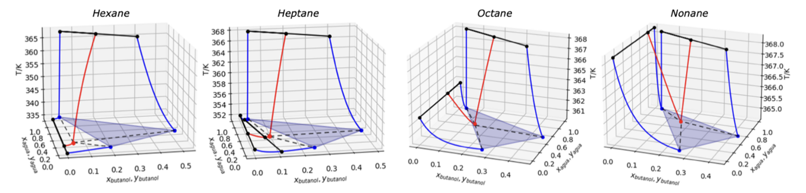

The vapor-liquid-liquid equilibria (VLLE) for water + butanol + alkane mixtures was evaluated using the group contribution-based molecular SAFT-γ Mie equation of state [^1]. To that end, we used the SGTpy python module [^2], which is an open-source code distributed through the following Git-hub: 

We modeled the binary water + butanol / water + alkane / alkane + butanol binary mixtures, using as alkanes = hexane, heptane, octane and nonane. We saw good accuracy in reproducing all binary phase equilibria and then proceed to model the three-phase equilibria. We obtained the following ternary heteroazeotropic lines for each system: 

  

A three-phase line with a low temperature heteroazeotropic point was located for all systems, all containing a 4-phase point (VLLL) equilibrium alongside the VLLE line, which was not reported for these systems. In long-chain alkanes the heteroazeotrope coincides with the 4-phase point, whereas short-chain alkanes they are located at different thermodynamic coordinates. 

The existence of the 4-phase point ___ is something interesting ___ because...

Then we have evaluated the suitability of those thermodynamic scenarios in a standard heteroazeotropic distillation process. We have built the residue curve maps and carried out material balances to determine which alkane performs better for the dehydration.

The complete work is compiled in the Undergraduate Theses of Octavio Barría [^3] and Nicolás Díaz [^4]. Please check them out for more information. Hyperlinks are included to each paper and thesis.

[^1]: saft-g
[^2]: sgtpy
[^3]: octavio
[^4]: nico

---------------------------------------------------------------------------

<a href="./Methodology" class="banner-link etapa-1">
  STAGE 1: Methodology & Molecular Simulation
</a>

<a href="./Non-polar-entrainers" class="banner-link etapa-2">
  STAGE 2: Non-polar Entrainers (Hydrocarbons)
</a>

<a href="./Polar-entrainers" class="banner-link etapa-3">
  STAGE 3: Polar Entrainers (Ethers & Mixed)
</a>
