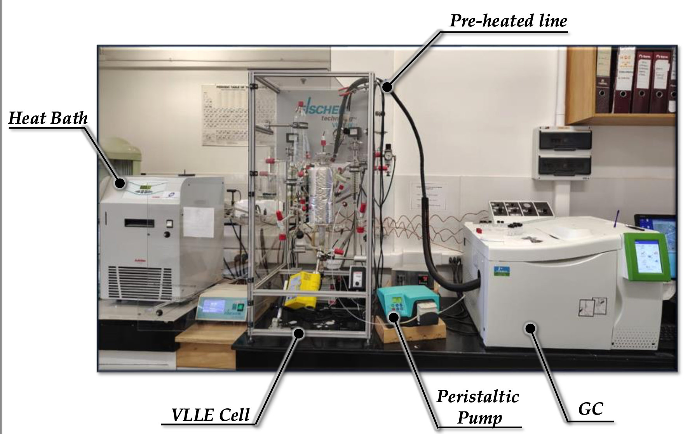

The vapor-liquid-liquid equilibria (VLLE) for water + butanol + polar entrainer mixtures was evaluated using the group contribution-based molecular SAFT-VR Mie equation of state [^1]. To that end, we used the SGTpy python module [^2], which is an open-source code distributed through the following Git-hub: 

We modeled the binary water + butanol / water + entrainer / entrainer + butanol binary mixtures, using as entrainers = cyclopenthyl methyl eter (CpME) and dimethyl carbonate (DMC). We saw good accuracy in reproducing all binary phase equilibria and then proceed to model the three-phase equilibria. Since no experimental data was available for the ternary VLLE line, we carried out three-phase equilibrium experimental determinations with thecommercial Fisher VLE/VLLE 602 equilibrium cell available in the Cohesion Laboratory at the Universidad de Concepción: 

  
  <figcaption>Figure 1: Commercial Fisher VLE/VLLE 602 equilibrium cell to measure three-phase equilibria. </figcaption>

We obtained the following ternary three phase lines for each system, which all behave zeotropically and exhibit no heteroazeotropic point (no temperature minimum within the ternary 3-phase line). However, we observed that the mutual miscibilities amongst water/butanol/entrainer depend strongly on the polarity of the entrainer and specially on their associative capabilities. CpME has a single hydrogen bond (HB) acceptor site in the -O- atom, whereas DMC has three sites (two carbonyl =O and a ether -O- atoms). So the DMC LLE is much "thinner" than in CpME. In fact, DMC shows even a has a convex curvature in its ternary LLE, showing a strong deviation from the (more) common concave pattern shown by CpME.

  
  <figcaption>Figure 2: VLLE for water + butanol + entrainer = (a) CpME or (b) DMC. Blue, black and red correspond to the aqueous liquid, organic liquid and vapor phases, respectively. Dots are experimental determinations performed at the cohesion laboratory and lines are SAFT models </figcaption>

These results denote that associative compatibility is negative for the separation of water + butanol mixtures, because it favors mixing, instead of separation. It is worth noting that some of this compounds are great entrainers for ethanol dehydration, but etanol is naturaly more compatible with water that butanol, so it is more succeptible to be dehydrated by polar entrainers. The lower water compatibility of butanol makes it unsuitable for polar entrainer dehydration.

The complete works with more technical details are compiled in the corresponding publications [^3],[^4]. Please check them out for more information. 
  
Additionally, some codes and tutorials are shared in here to teach how to calculate these particular phase equilibria with SGTpy:
  - **Recommended Start:** VLLE prediction with SGTpy _(insert link to tutorial 1)_
  - **Water+Butanol+CPME:** 
  - **Water+Butanol+DMC:** 
    

[^1]: Lafitte, T., Apostolakou, A., Avendaño, C., Galindo, A., Adjiman, C.S., Müller, E.A., Jackson, G. (2013) Accurate statistical associating fluid theory for chain molecules formed from Mie segments. J. Chem. Phys. 139 (15): 154504.
[^2]: Mejía, A. E.A. Müller, G. Chaparro, (2021) SGTPy: A Python Code for Calculating the Interfacial Properties of Fluids Based on the Square Gradient Theory Using the SAFT-VR Mie Equation of State. J. Chem. Inf. Model. 61: 1244-1250.
[^3]: Alonso, G., Cartes, M., Mejía, A. (2025) Vapor-liquid-liquid equilibria for the water + 1-butanol + CPME mixture. Fluid Phase Equilib. 591: 114297
[^4]: Ulloa, A., Cartes, M., Alonso, G., Mejía, A. (2025) Three phase equilibria and interfacial properties of water + dimethyl carbonate + 1-butanol ternary mixture. J. Mol. Liq. 439: 128785

---------------------------------------------------------------------------

<a href="./Methodology" class="banner-link etapa-1">
  STAGE 1: Methodology & Molecular Simulation
</a>

<a href="./Non-polar-entrainers" class="banner-link etapa-2">
  STAGE 2: Non-polar Entrainers (Hydrocarbons)
</a>

<a href="./Polar-entrainers" class="banner-link etapa-3">
  STAGE 3: Polar Entrainers (Ethers & Mixed)
</a>

