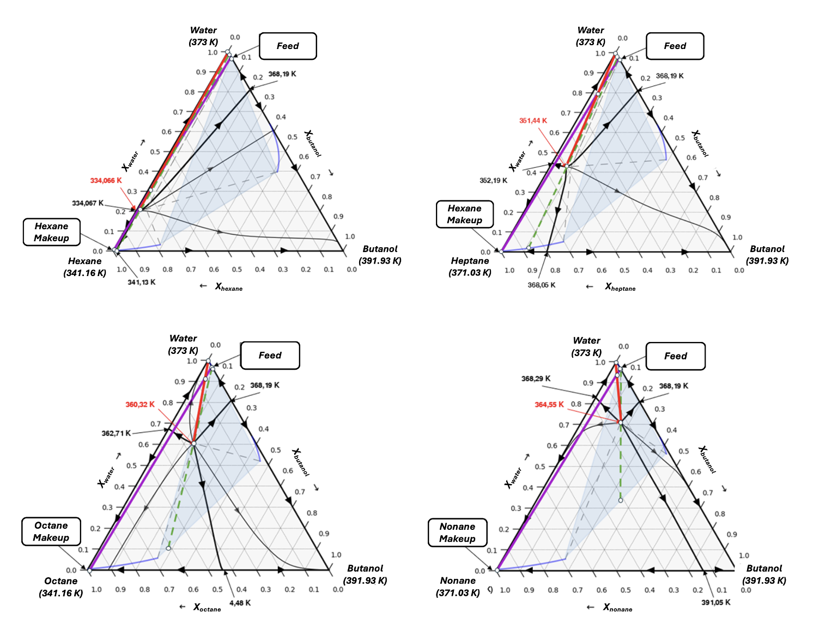
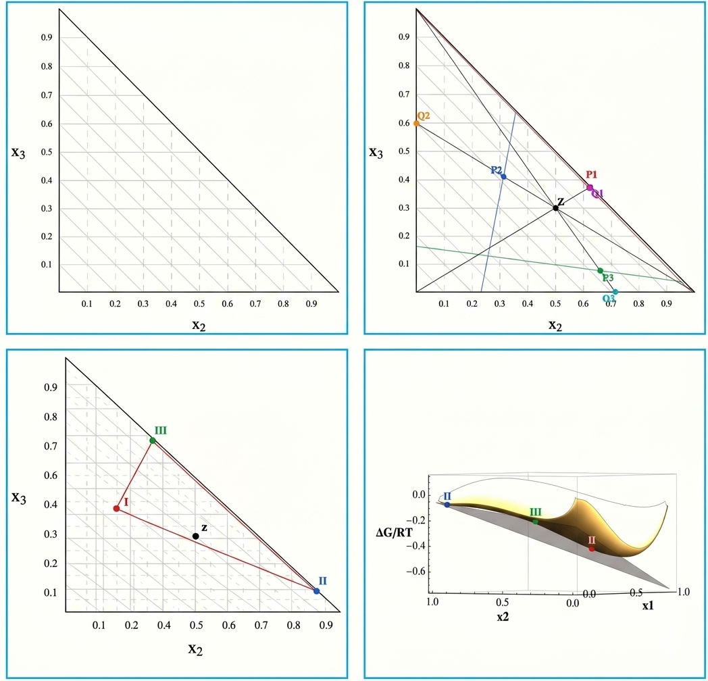

The vapor-liquid-liquid equilibria (VLLE) for water + butanol + polar entrainer mixtures was evaluated using the group contribution-based molecular SAFT-γ Mie equation of state [^1]. To that end, we used the SGTpy python module [^2], which is an open-source code distributed through the following Git-hub: 

We modeled the binary water + butanol / water + entrainer / entrainer + butanol binary mixtures, using as entrainers = cyclopenthyl methyl eter (CpME) and dimethyl carbonate (DMC). We saw good accuracy in reproducing all binary phase equilibria and then proceed to model the three-phase equilibria. Since no experimental data was available for the ternary VLLE line, we carried out three-phase equilibrium experimental determinations with thecommercial Fisher VLE/VLLE 602 equilibrium cell available in the Cohesion Laboratory at the Universidad de Concepción: 

  
  <figcaption>Figure 1: Commercial Fisher VLE/VLLE 602 equilibrium cell to measure three-phase equilibria. </figcaption>

We obtained the following ternary three phase lines for each system, which all behave zeotropically and exhibit no heteroazeotropic point. For this mixture, the : 

A three-phase line with a low temperature heteroazeotropic point was located for all systems, all containing a 4-phase point (VLLL) equilibrium alongside the VLLE line. In long-chain alkanes the heteroazeotrope coincides with the 4-phase point, whereas in short-chain alkanes they are located at different thermodynamic coordinates. The predicted results allowed to evaluate how molecular shape and interactions affect phase equilibria for alkane based entrainers. That is:
  - The less non-polar alkanes displace significantly the butanol-rich end of the VLLLE and keep the vapor end close to the water + alkane binary.
  - Large chain alkanes keep the butanol-rich end of the VLLLE similar to the binary water + butanol and displace significantly the vapor end.
This is correlated with the temperature of the binary azeotropes. When binary mixtures have similar heteroazeotropic temperatures the vapor phase is placed in the center of the line, whereas when they have different temperatures the vapor phase is found closer to the lower boiling point binary mixture. 

We then aimed to evaluate the suitability of those thermodynamic scenarios in a standard heteroazeotropic distillation process. We have built the residue curve maps and carried out material balances to determine which alkanes perform better for the dehydration. After observing the compositions of the $1^{st}$ column product, we concluded that the distillation frontiers prevent those mixtures to be directly separated with this setup. However, the existence of the 4-phase point opens up new separation scenarios that can be exploited for separation, since the decanter will not generate 2 phases, but 3 at equilibrium. Those 3 phases can be treated separately or mixed at different ratios depending on the process needs. Exploring different distillation processes lays out of scope for this project but should be kept in mind when treating with such mixtures in the future.

  
  <figcaption>Figure 2: Residue curve maps for the water + butanol + alkane ternary mixtures. The green dashed curve shows the composition of the liquid phase exiting the condenser after the $1^{st}$ column .</figcaption>

Process simulations can be carried out to design new separation setups, but distillation of such ternary mixtures ended in a 4-phase VLLLE configuration, which has convergence difficulties due to the 3 liquids at equilibrium. For this reason, we have produced a free code based on activity coefficient models to incorporate robust 3-liquid equilibrium calculations in process simulations in the future. In this code we use the idea of Lucia et al., [^3] and Dennes et al [^4], who minimizes the Gibbs free energy of a mixture combining a flash (with a given global composition) and applying material balances to them. The method allows to predict the LLL phase equilibria solely from an initial global composition by first analyzing the miscibilities of each pair and then attemting to 

  
  <figcaption>Figure 3: Prediction method for the LLLE .</figcaption>

The complete works are compiled in the Undergraduate Theses of Octavio Barría [^5] and Nicolás Díaz [^6]. Please check them out for more information. The links to the repository with those theses are can be found below:
  - UdeC Repository: [https://repositorio.udec.cl/items/c98879ec-649d-48d6-8b43-3d8f5e04b8df](https://repositorio.udec.cl/search?spc.page=1&query=)
  - GitHub Repository for the LLLE code: 
  
Additionally, some codes and tutorials are shared in here to teach how to calculate these particular phase equilibria with SGTpy:
  - **Recommended Start:** VLLE prediction with SGTpy _(insert link to tutorial 1)_
  - **Other Thing:** VLLLE prediction with SGTpy _(insert link to tutorial 2)_

[^1]: Papaioannou, V., Lafitte, T., Avendaño, C., Adjiman, C.S., Jackson G., Müller, E.A., Amparo G. (2014) .Group contribution methodology based on the statistical associating fluid theory for heteronuclear molecules formed from Mie segments. J. Chem. Phys. 140: 054107
[^2]: Mejía, A. E.A. Müller, G. Chaparro, (2021) SGTPy: A Python Code for Calculating the Interfacial Properties of Fluids Based on the Square Gradient Theory Using the SAFT-VR Mie Equation of State. J. Chem. Inf. Model. 61: 1244-1250.
[^3]: Lucia, A., Padmanabhan, L., and Venkataraman, S. (2000). Multiphase equilibrium flash calculations. Comp. Chem. Eng., 24(11):2557–2569.
[^4]: Denes, F., Lang, P., & Lang-Lazi, M. (2006). Liquid–liquid–liquid equilibrium calculations. In Symposium Series No. 152. IChemE
[^5]: Barría, O (2025). Optimización del Proceso de Deshidratación de Bio-Butanol con Hidrocarburos. Undergraduate Thesis, Universidad de Concepción
[^6]: Díaz, N (2025). Predicción del Equilibrio Multifásico Líquido-Líquido-Líquido Usando Modelos de Coeficientes de Actividad. Undergraduate Thesis, Universidad de Concepción

---------------------------------------------------------------------------

<a href="./Methodology" class="banner-link etapa-1">
  STAGE 1: Methodology & Molecular Simulation
</a>

<a href="./Non-polar-entrainers" class="banner-link etapa-2">
  STAGE 2: Non-polar Entrainers (Hydrocarbons)
</a>

<a href="./Polar-entrainers" class="banner-link etapa-3">
  STAGE 3: Polar Entrainers (Ethers & Mixed)
</a>
