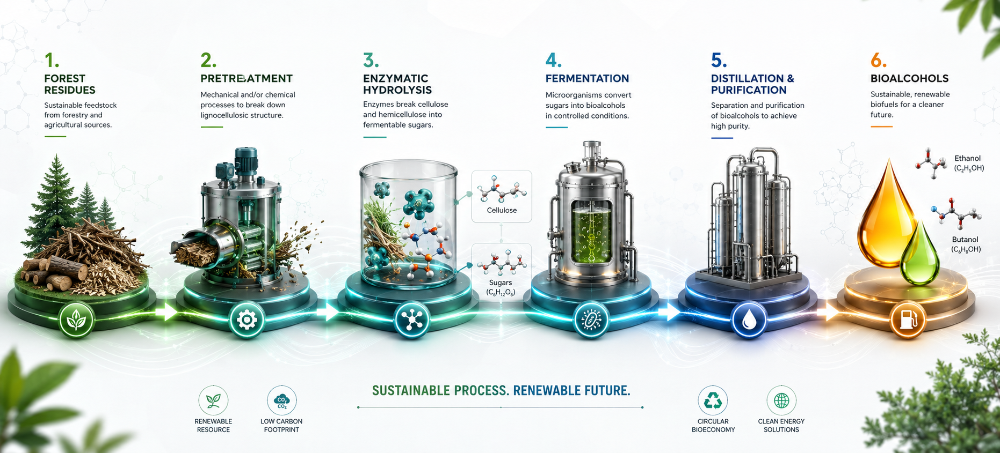

# BIOFUEL PRODUCTION OPTIMIZATION: EXPLORATION OF THE BEST THERMODYNAMIC SCENARIO FOR BIO-BUTANOL DISTILLATION

The worldwide energy production is at a crossroads because the carbon emissions from traditional fossil fuels are driving a global climate crisis. To protect our environment, it is urgent that we switch to renewable energy sources like wind, solar, and biofuels. Bio-alcohols, such as butanol, are a particularly exciting alternative because they can be made from fermentation of forestry waste or algae, which are totally renewable and can fixate $CO_2$ during its growing process, mitigating the global emmisions. 

  

However, the production process leaves the alcohol mixed with larges amounts of water. In order for these biofuels to work safely in car engines (as a replacement for gasoline) it is necesary to almost completely remove this water. Currently, this “drying” process is incredibly difficult and consumes a massive amount of energy, which makes green fuel more expensive and less efficient to produce. Bridging this gap is not just a technical challenge; it is a necessary step to ensure that the clean energy transition is both practical and affordable for everyone in society.

The idea behind this project was to find a way to improve the bio-butanol drying process via a well known separation technique called “heterogeneous azeotropic distillation”. To perform it, a third components called “Entrainer” is usually added into the water + alcohol mixture to help drive the water away from the fuel. However, instead of exploring many different entrainers into the laboratory we conducted this research by using molecular based simulations and theory to understand how these entrainers behave at a molecular level. Specifically, we have evaluated the impact of the molecular shape and chemical nature of the entrainers and predicted how the separation process will occur. Finally, the best behaving systems and/or complex to model mixtures were brought to the laboratory for validation and evaluation.

Our results provide a pathway for improving the bio-butanol separation, showing that non-polar hydrocarbons (alkanes) are the best candidates for the task. They create a powerful “incompatibility” that can force the water and fuel apart very effectively and opens up the possibility of exploring different separation techniques previosuly unusable. On the other hand, entrainers with oxygen groups (polar entrainers), which are promising to dry ethanol, make species more compatible with each other and do not yield adequate properties to dry this fuel. This discovery points out mechanisms to improve bio-butanol dehydration and paves the way to propose newly efficient drying techniques for bio-butanol, which may eventually help in reducing the overall carbon footprint of the entire process. Ultimately, this research moves us closer to a world where high-performance, eco-friendly fuel is a cost-effective reality for everyday drivers.
