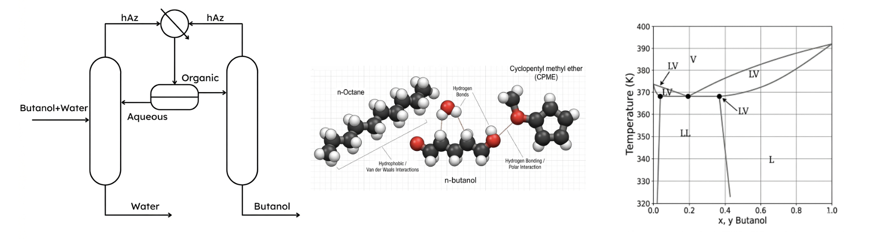

# BIOFUEL PRODUCTION OPTIMIZATION: EXPLORATION OF THE BEST THERMODYNAMIC SCENARIO FOR BIO-BUTANOL DISTILLATION

Our world currently relies on fossil fuels that release carbon emissions, fueling the global climate crisis. To protect the environment, we must transition to renewable energy. While wind and solar are vital, biofuels offer a unique solution for transportation because they can be produced from renewable sources like forestry waste or algae.

Bio-alcohols, such as butanol, are especially promising. Unlike fossil fuels, the plants and algae used to create them actually "breathe in" and fixate $CO_2$ as they grow, helping to offset emissions. This creates a circular, cleaner energy cycle. The production process involves fermentation, which results in a mixture of alcohol and a large amount of water. For these fuels to be used safely in car engines as a substitute for gasoline, they must be almost perfectly dry. Currently, removing this water is the "bottleneck" because the process is energy intensive, so bridging this technical gap is essential. Solving the water-removal problem is the key to making the clean energy transition practical and affordable for everyone.

  

The idea behind this project was to use molecular simulations and theoretical modeling to find a way to improve the bio-butanol drying process via “heterogeneous azeotropic distillation”. To perform it, a third components called “Entrainer” is usually added into the water + alcohol mixture to help separating the water from the fuel. The main goal was to understand how these entrainers behave at a molecular level and connect the molecular shape and chemical nature of the entrainers with how the separation process will occur. Finally, the best behaving systems and/or complex to model mixtures were brought to the laboratory for validation and evaluation.

  

This separation is governed by the vapor-liquid-liquid equilibrium exhibited by the ternary mixture, where the temperature and composition at of the heterogeneous azeotrope is a critical parameter for process design. In this regard, we have studied how non-polar hydrocarbons (alkanes) and polar entrainers (with O- heteroatoms) affect the heterogeneous azeotrope properties of the ternary mixture.

Our results provide a better understanding of the molecular role of each entrainer, which is critical for improving the bio-butanol separation. We showed that non-polar entrainers are the best candidates for the task, because they create a powerful “incompatibility” that can force the water and fuel apart very effectively. This opens up the possibility of exploring different separation techniques previosuly unusable. On the other hand, entrainers with oxygen groups (polar entrainers), which are promising to dry ethanol, make species more compatible with each other and do not yield adequate properties to dry this fuel. 

This discovery points out mechanisms to improve bio-butanol dehydration and paves the way to propose newly efficient drying techniques for bio-butanol, which may eventually help in reducing the overall carbon footprint of the entire process. Ultimately, this research moves us closer to a world where high-performance, eco-friendly fuel is a cost-effective reality for everyday drivers.

------

To delve deeper into the insights achieved by this project follow the next tabs

<a href="./Methodology" class="banner-link etapa-1">
  STAGE 1: Methodology & Molecular Simulation
</a>

<a href="./Non-polar-entrainers" class="banner-link etapa-2">
  STAGE 2: Non-polar Entrainers (Hydrocarbons)
</a>

<a href="./Polar-entrainers" class="banner-link etapa-3">
  STAGE 3: Polar Entrainers (Ethers & Mixed)
</a>
