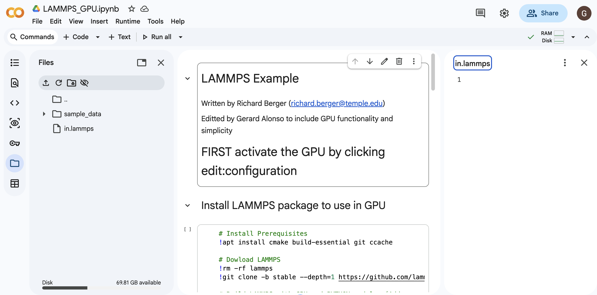
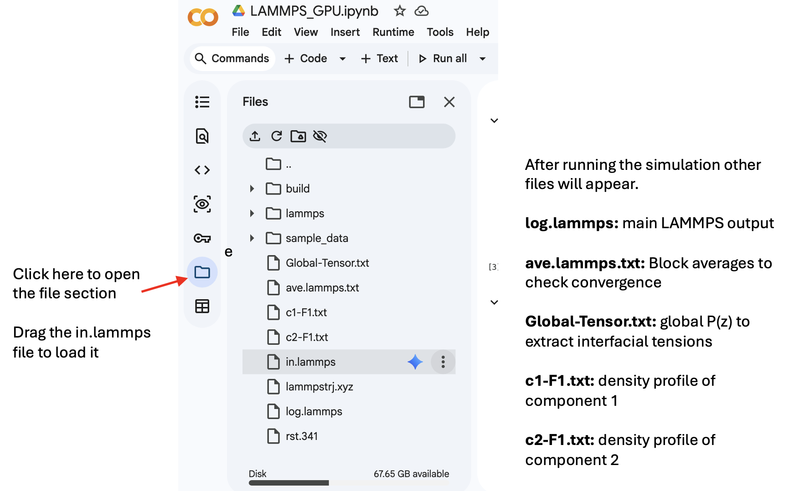
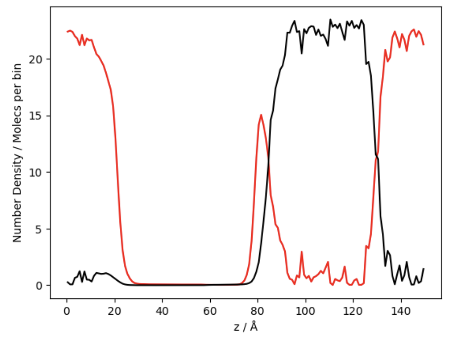

# Tutorials for a VLLE simulation with LAMMPS

In this page we will share how to carry out proper VLLE simulations with the LAMMPS code [^1] using a simple mixture of LJ fluids. The first thing one needs is a suitable hardware to run the code. This may be your own computer, an HPC cluster or some on-line tool such as Google Colab. In this tutorial I will assume you do not have no access to any computing resources, so you will use Google Colab. 

Google Colab allows users to work for a limited time using a combination of 2 CPUs + 1 GPU (Nvidia T4) for free. This tutorial will allow you to run a VLLE calculation for a short time frame and analyze the obtained results. Proper publication-level simualtions require significantly more time and statistics to properly run but free Google Colab will disconnect us before ending those simulations. For this reason, inputs will come with comments on how to modify them to improve them from "cheap examples" to "publication ready simulations".

First enter into the Colab webpage, get an account (if you don't have it already) and log in. If your account is ready, just click the following link to open the LAMMPS-ready Colab notebook:

[](https://colab.research.google.com/github/Gerard-Alonso/Gerard-Alonso.github.io/blob/main/Tutorials/LAMMPS_GPU.ipynb)

### Step 1: Setting your LAMMPS
This notebook has 2 blocks:
- An installation block for GPU-based LAMMPS with an NVIDIA T4 architecture (the standard Google Colab uses for free users)
- An execution block with 1 CPU + 1 GPU

GPU installation is strongly recomended because VLLE simulations on LJ fluids is extremely efficient. Simulations in a single CPU will be 4 h long wereas 1 CPU + 1 GPU will last 4 minutes. the GPU is not available by default, one needs to manually select a session with it clicking at "Runtime" > "Change Runtime Type" and then select the T4 GPU accelerator in the pop-up window. After "Saving" the settings, the session will be GPU ready. 

<p align="center">
  
</p>

Execute the $1^{st}$ block and install GPU-LAMMPS. This is an "almost-minimal" installation of LAMMPS containig the basic packages and the optional RIGID, GPU and EXTRA-PAIR packages. The installation may last for around 35 minutes and a message will pop up at some point informing that the GPU is not being used. Ignore the message and wait for the installation to complete. I recommend starting this tutorial with time and setting the installation right now, even if you are not ready to simulate. You can set everything up in parallel to the installation process.

## Step 2: Preparing your input file.
While the installation runs, prepare the LAMMPS input file for the VLLE calculation and upload it to Google Colab. Proper direct coexistence calculations are built by splitting an orthorrombic simulation cell ($L_x = L_y < L_z$, with $\alpha=\beta=\gamma=90°$) into three sections, each containing one L or V phase. The simulation cell size should be ideally $L_x = L_y > 10 \sigma$ and $L_z > 7 L_x$ to ensure a good molecule count in the interface (in the $xy$ direction) and enough lenght of each bulk phase (in the $z$ direction). We then build each phase according to their corresponding density and composition, when known. If those are not known one can use pure component densities and assume ideal mixing to have a sensible initial guess and let MD equilibrate to the actual density and composition. Here is an example of the simulation cell we want to build:

<p align="center">
  
</p>

Also interfacial tension values converge when the energy cutoff radius ($r_{cut}$) is larger than $5.5-6\sigma$. With those settings, simulations should evolve for very long times to ensure dynamical equilibrium. It is recommended to run at least 100 ns and monitor the temporal evolution of:
- (1) **The energy:** As a fast and simple check of convergence. This will be located in the **ave.lammps.txt** output file in this tutorial
- (2) **Each interfacial tension:** As a more certain check of convergence, since pressure -> tension oscillates wildy. This will be post-processed from the **Global-Tensor.txt** output file.
- (3) **The component-wise density profile:** To find any change in particle distribution within each phase. This will be post-processed from the **C1/C2-F1.txt** output files.

The following LAMMPS input file is designed to create a VLLE cell with two LJ fluids (types 1 and 2) with different $\varepsilon_i$ parameters, time evolve it and obtain all necessary outputs to post-process the pressure tensor in the Irving & Kirkwood formulation [^2]. Time evolution should be performed at the NVT ensemble to only fix temperature. Equilibrium pressure will be obtained from the pressure tensor profile. More information on which parameters are adequate for an interfacial tension calculation can be found at the corresponding "best practices" reference paper [^3]

$\gamma^{\alpha\beta}=\int_a^b{P_{zz}-\frac{ P_{xx}+P_{yy} }{2}} dz$

With Google Colab opened, and LAMMPS installing, open the "folder" icon in the left-hand side of the webpage to see the "files navigator". Right click onto the window space and click  "New File". Name it "in.lammps" to match the google colab notebook expected input name. When you double click it you sould see a new empty panel to write the input file. This is what you should be seing:

<p align="center">
  
</p>

Now copy the following LAMMPS input file into the right hand panel, which contains the **in.lammps** file:

```lammps
# ----------------- Initial Definitions ------------------
units		real    # r(Å), t(fs), E(Kcal/mol), T(K), P(atm)
boundary 	p p p	# PBCs in 3 directions
dimension 	3	# 3D simulation
atom_style  	full	# Molecular representation

# ----------------- Set up the system ------------------
lattice 	custom 1 a1 35 0. 0. a2 0. 35  0. a3 0. 0. 150.  basis 0. 0. 0
      # for producction use (a1 48 0 0 a2 0 48 0 a3 0 0 240)

region 		VLLE 	block 0 1 0 1 0 1 units lattice 
create_box 	2 	VLLE 
region 		L1 	block 0 1   0 1   0.06 0.3933 units lattice
region 		L2 	block 0 1   0 1   0.3933 0.7266 units lattice  
region 		V 	block 0 1   0 1   0.7266 1 units lattice 

create_atoms 	1 random 1000 	9323 	L1
create_atoms 	2 random 40 	  1104 	L1
create_atoms 	1 random 40 	  4401 	L2
create_atoms 	2 random 1000 	9922 	L2
create_atoms 	1 random 5 	    1244	V
create_atoms 	2 random 2      5331 	V
          # for production multiply all molecule numbers x3

mass	  1	    16
mass    2     16
group 	c1 	  type 1
group 	c2 	  type 2

# ----------- Force Field & Relaxation -------------
pair_style	lj/cut		14
      # for production use a 22.5 cutoff

#Mie Coeff    i j     eps(Kcal/mol)    s (Å)   
pair_coeff	  1 1     0.2941           3.73     
pair_coeff	  2 2     0.3979           3.73    
pair_coeff	  1 2     0.301          	 3.73     
pair_modify	tail	no

# 		Etol	      Ftol	   Maxiter	Maxeval
minimize 	1.0e-4 	     1.0e-6 	    1000       10000

reset_timestep  0
# ------------------ Prints ----------------------
thermo 		1000					
thermo_style 	custom	step cpu temp press density etotal ke pe evdwl etail 

dump 	1	all 	xyz 	100000 	lammpstrj.xyz   
restart		10000000	rst

# -------------- Run and Average -----------------

timestep	4	
fix 	TP 	all 	nvt 	temp 91 91 100

# Make block averages for energy
variable      	TotEng  equal etotal
fix averages	all     ave/time 20 5000 100000 c_thermo_temp c_thermo_press[0] c_thermo_press[1] c_thermo_press[2] c_thermo_press[3] v_TotEng  file ave.lammps.txt      

# Compute density and pressure profiles
compute   lala all chunk/atom bin/1d z lower 1 units box
compute 	T 	all temp
compute 	press 	all stress/atom T

fix 	tensor1 all 	ave/chunk 20 50000 1000000 lala density/number c_press[1] c_press[2] c_press[3] 	file Global-Tensor.txt
fix 	tensor2 c1 	ave/chunk 20 50000 1000000 lala density/number file c1-F1.txt
fix 	tensor3 c2 	ave/chunk 20 50000 1000000 lala density/number file c2-F1.txt
      # for production run all (ave/chunk 20 500000 10000000)

run 1000000
      # for production run 60 milion steps
```

## Step 3: Run and check convergence.

Once the $1^{st}$ cell ends the LAMMPS installation we will directly run the $2^{nd} cell to execute the simulation. Many new output files will appear onto the "files navigator" panel as seen in the following picture. We will wait for the simulation to end and we will download all files mentioned here to post-process:

<p align="center">
  
</p>

To check the energy convergence apply the following python code to the **ave.lammps.txt** file. You'll need the common numpy and matplotlib modules to make it work:

```python
import matplotlib.pyplot as plt
import numpy as np

data = np.loadtxt('ave.lammps.txt')

plt.plot(data[:,0]/1e6, data[:,6], 'o-')
plt.xlabel('time / ns')
plt.ylabel('Energy / kcal/mol')
```

You should get a rapidly converging function like the following one:

<p align="center">
  
</p>

Dynamical density profile converge is also a safety check. In this tutorial we have only generated two density profiles. However, production should provide several plots at different times and they should all be overlapped in a single figure. Once the profile does not change, dynamical equilibrium is achieved.

```python
import matplotlib.pyplot as plt

with open('c1-F1.txt', 'r') as f:
    F = f.readlines()

frame1 = [line.split() for line in F[4:154]]
frame2 = [line.split() for line in F[155:305]] 
a1_x = [float(line[1]) for line in frame1]
a1_y = [float(line[2]) for line in frame1]
a2_x = [float(line[1]) for line in frame2]
a2_y = [float(line[2]) for line in frame2]

with open('c2-F1.txt', 'r') as f:
    F = f.readlines()

frame1 = [line.split() for line in F[4:154]]
frame2 = [line.split() for line in F[155:305]] 
b1_x = [float(line[1]) for line in frame1]
b1_y = [float(line[2]) for line in frame1]
b2_x = [float(line[1]) for line in frame2]
b2_y = [float(line[2]) for line in frame2]


fig, (ax1, ax2) = plt.subplots(1, 2, figsize=(10, 4), sharey=True)

ax1.plot(b1_x, b1_y, 'r')
ax1.plot(a1_x, a1_y, 'k')

ax1.set_title("Frame 1")
ax1.set_xlabel("Z / Å)")
ax1.set_ylabel("Number density / molecs per bin")

ax2.plot(b2_x, b2_y, 'r')
ax2.plot(a2_x, a2_y, 'k')
ax2.set_title("Frame 2")
ax1.set_xlabel("Z / Å)")

fig.tight_layout()
plt.show()
```

You will see a poorly averaged density profile with an $\alpha$ phase rich in component one (in red) accumulating at the vapor-$\beta$ interface. The $\beta$ phase is rich in component 2 (in black). No accumulation is seen in the LL or the $\alpha$-Vapor interfaces.

<p align="center">
  
</p>

## Step 4: Extract the IFT
The LAMMPS simulation we've made extracts the average stress tensor (represented by $\sigma_{ab}$) felt in a bin, not the pressure tensor (represented by $P_{ab}$), so we need to convert it. The relationship between both is:

$P_{ij} = - <N_{bin}> <\sigma_{ij}>/V_{bin}$

In the following python code, we take the elements of the stress tensor and make this conversion for the three $P_{xx}, P_{yy}, P_{zz}$ elements and we make a cumulative integral for each z (from 0 to z). We plot both, the pressure tensor (to see the anisotropy generated at the interface) that give rise to the cumulative interfacial tension plateaus. The plateau difference average heigh is directly the tension of each interface.

```python
import matplotlib.pyplot as plt
import numpy as np
from scipy.integrate import cumulative_trapezoid  # previously known as cumtrapz

#data = np.loadtxt('Global-Tensor.txt', skiprows=4)

with open('Global-Tensor.txt', 'r') as f:
    F = f.readlines()

Vbin = 38 * 38 * 1   # Volume in Å3 of each bin. 38 is the Lx and Ly. 1 is the width chosen for each bin

frame2 = [line.split() for line in F[155:305]] 
z   = np.array([float(line[1]) for line in frame2])
N  = np.array([float(line[2]) for line in frame2])
sx = np.array([float(line[4]) for line in frame2])
sy = np.array([float(line[5]) for line in frame2])
sz = np.array([float(line[6]) for line in frame2])

Px = -N*sx/Vbin
Py = -N*sy/Vbin
Pz = -N*sz/Vbin
dg = (Pz - (Px+Py)/2) *0.0101325    # conversion from Real to mN/m
cum_IFT = cumulative_trapezoid(dg, z)

fig, (ax1, ax2) = plt.subplots(1, 2, figsize=(10, 4))
ax1.plot(z, Px,'r-')
ax1.plot(z, Py,'b-')
ax1.plot(z, Pz,'k-')
ax1.set_xlabel('z / Å')
ax1.set_ylabel('P / atm')

ax2.plot(z[1:], cum_IFT,'r-')
ax2.set_xlabel('z / Å')
ax2.set_ylabel('γ / mN m-1')
```

<p align="center">
  
</p>

The resulting interfacial tensions from this point are: $\gamma^{\alpha\beta}= XX; \gamma^{\alpha\delta}= YY; and $\gamma^{\beta\delta= ZZ}$.
